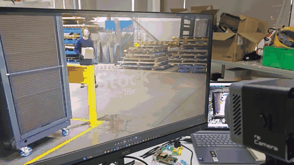

# reCamera Pro Fall Detection

[中文文档](README-cn.md)

## Demo



[▶ Watch the full demo video](assets/fall-detection-demo.mp4)

Native fall detection for **Seeed reCamera Pro (RV1126B, aarch64)**. It runs an INT8 YOLOv8n-Pose RKNN model on-device, tracks people, emits WebSocket alerts, publishes an annotated RTSP stream, and can play an audible alert.

## Quick start (no build required)

Download `recamera-fall-detection-rv1126b.tar.gz` from the [latest Release](https://github.com/yyling0101-a11y/reCamera_pro_fall_detection/releases/latest), extract it, and copy the directory to your reCamera Pro:

```sh
tar -xzf recamera-fall-detection-rv1126b.tar.gz
scp -r recamera-fall-detection root@<RECAMERA_IP>:/userdata/
ssh root@<RECAMERA_IP>
cd /userdata/recamera-fall-detection
sha256sum -c SHA256SUMS
./run.sh
```

The bundle contains the aarch64 executable, quantized RV1126B INT8 RKNN model, alert sound, launcher, and checksums. It is not compatible with x86_64 Linux or RISC-V reCamera hardware.

The default camera node is `/dev/video13`; WebSocket uses port `9000` and RTSP uses port `8554`. If your firmware exposes another camera node, pass `--device /dev/videoN`. Production reCamera Pro firmware must provide compatible RKNN Runtime 2.3.2 and GStreamer RTSP libraries; this project does not replace board runtime libraries.

View the annotated stream:

```sh
ffplay -rtsp_transport tcp rtsp://<RECAMERA_IP>:8554/fall
# or: vlc rtsp://<RECAMERA_IP>:8554/fall
```

WebSocket clients connect to `ws://<RECAMERA_IP>:9000/alerts`.

## Usage

```sh
./recamera_fall_detection \
  --model yolov8n-pose-int8-rv1126b.rknn \
  --ws-bind 0.0.0.0 --ws-port 9000 \
  --rtsp-port 8554 --rtsp-fps 10
```

| Option | Description |
| --- | --- |
| `--device /dev/video13` | V4L2 camera device |
| `--confidence 0.35` / `--nms 0.45` | Detection and NMS thresholds |
| `--no-rtsp` | Disable the RTSP service |
| `--alarm-test` | Test the alert queue and speaker only |
| `--websocket-test` | Test WebSocket transport without camera/model |
| `--max-frames N` | Exit after N frames for smoke tests |

Example alert:

```json
{"type":"fall_alert","severity":"critical","track_id":1,"state":"CONFIRMED_FALL","timestamp_ms":0,"torso_angle":24.1,"vertical_velocity":0.7}
```

## Requirements and limitations

- Target platform is reCamera Pro RV1126B (aarch64) with RKNN Runtime 2.3.2.
- Input is a 640×640 NV12 camera stream. See [MODEL_CONTRACT.md](MODEL_CONTRACT.md) for model I/O and quantization details.
- This is an assistive detection feature, not a medical, emergency-response, or life-safety system. Validate thresholds, lighting, occlusion, and alert delivery in the actual deployment.
- The model originates from Ultralytics YOLOv8n-Pose. Review the model contract and applicable licenses before redistribution.

## Build from source

Building requires an aarch64 toolchain and matching sysroot, GStreamer 1.22 development files, RKNN Runtime 2.3.2, and `rknn_api.h`. Do not link host x86_64 libraries into the target binary. Model conversion uses RKNN-Toolkit2 2.3.2 with target `rv1126b`; the conversion arguments are recorded in the `.rknn.json` files beside the models.

```sh
cmake -S . -B build \
  -DCMAKE_TOOLCHAIN_FILE=<toolchain-file> \
  -DRECAMERA_RKNNRT=<aarch64-librknnrt.so>
cmake --build build
```

## Project layout

- `src/`: capture, RKNN inference, pose/fall state machine, RTSP, WebSocket, and overlay rendering
- `include/`: public headers and RKNN C API header
- `tools/`: ONNX export and FP16/INT8 RKNN conversion scripts
- `MODEL_CONTRACT.md`: model input/output, quantization, and source record
- `calibration/README.md`: INT8 calibration notes (raw calibration data is not published)
